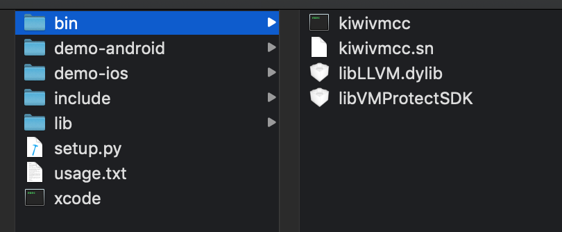
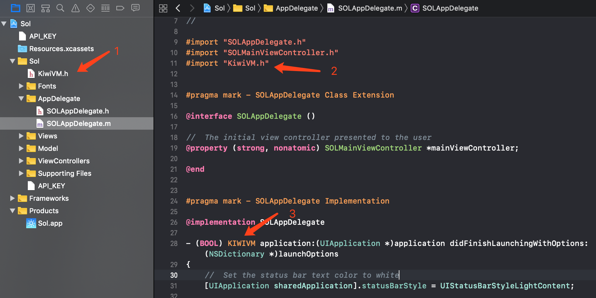
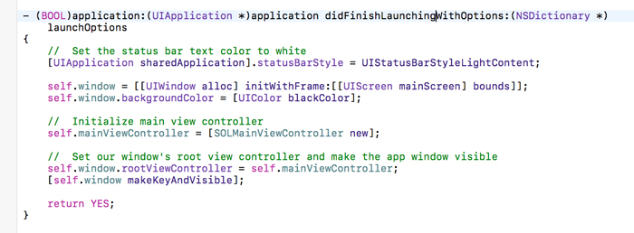
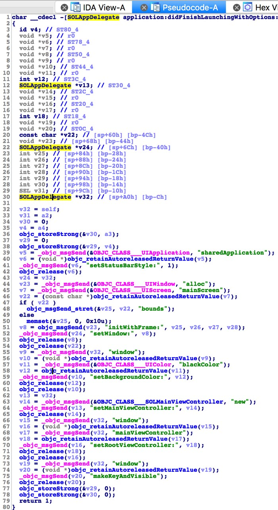
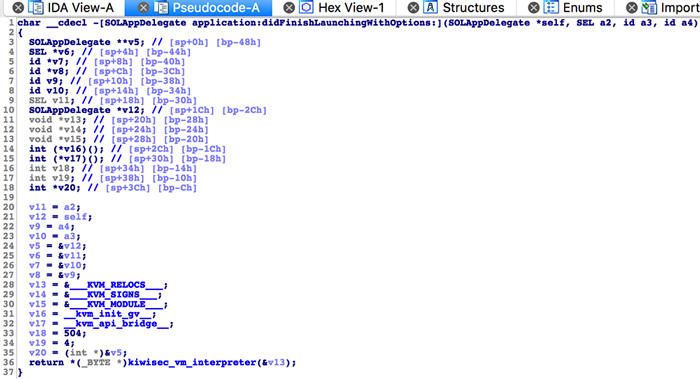

# [KiwiVM](https://en.kiwisec.com/product/vm-android.html)  

KiwiVM is a virtualization encryption software for mobile applications.
 
It is based on the Clang compiler extension and virtualizes specified functions when the project is compiled. With the features of a custom CPU instruction, once the code is encrypted and never decrypted, the attacker cannot restore the code and analyze the core business logic. Helps companies customize encryption for communications, payment, algorithms, and core technologies to avoid financial loss due to security issues.
 
[Learn how to use KiwiVM in your own project.](https://document.kiwisec.com/en/kiwiVM/)

## Features and Advantages
* **Deep Encryption:** Custom CPU instructions, encrypted code will not be decrypted.
* **Function Virtualization:** Virtualization protection of code functions for iOS projects
* **Full Architectures:** Support all cpu architectures such as armv7、armv7s、arm64 etc.
* **compatibility:** The implementation of IR code based on LLVM has no compatibility problem

## Documentation
You can find the KiwiVM documentation [on the website](https://document.kiwisec.com/en/kiwiVM).  

### 1. Obtain

> After purchasing the KiwiVM virtual machine, use the machine code generation tool provided by Kiwisec to extract the Key of the computer to be bound. Kiwisec will generate a unique KiwiVM toolkit based on Key, authorization time and enterprise information.

### 2. Install

After executing the xcode file, the tool will automatically replace the default compiler of xcode, launch the xcode development tool, and automatically restore the original compiler after exiting.

### 3. Import header file
Copy the header file in the include directory into your iOS project and refer to it as needed.

### 4. Add label KIWIVM
For functions that require virtualization protection, add the KIWIVM tag to notify the compiler to virtualize compilation. 

### 6. Build
Execute the build in the xcode tool

### 7. Uninstall
After exiting the xcode tool, KiwiVM's startup script automatically restores the original compiler

### 8. Effect analysis
This document takes an open source project as an example, links: [https://github.com/comyar/Sol](https://github.com/comyar/Sol)

* **Source Code:**

* **Decompiling raw code:**

* **Decompiled virtualized code:**

## Introduce
Relying on the technical advantages of the team, KiwiSec focuses on next-generation technology and product development in mobile safety. After 8 years of accumulation in compiler security technology, and 3 years’ continuous research and development, the original KiwiVM virtual machine product has completely solved the problems of weak protection and poor compatibility inherent in traditional technologies such as hardening and obfuscation, providing a convenient and effective security solution.

[Learn more](https://en.kiwisec.com)
